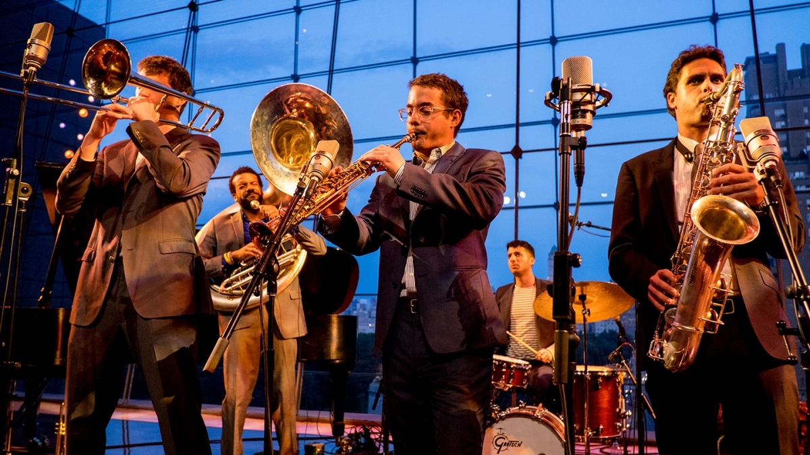

# JAZZ FESTIVAL Kaliningrad - React Application

React-приложение для Международного фестиваля джазовой музыки в Калининграде с возможностью управления контентом.

## 🎷 О проекте

Одностраничное React-приложение для продвижения джазового фестиваля с динамическим интерфейсом. В отличие от статической HTML-версии, этот проект использует современный стек технологий для создания интерактивного пользовательского опыта.

**Основные особенности:**
- React-приложение с компонентной архитектурой
- Динамическая загрузка контента
- Современный и адаптивный UI
- Локальный state-менеджмент

## 📁 Структура проекта
jazz-festival-react/

├── public/ # Статические файлы

│ ├── index.html # Основной HTML файл

│ ├── resources file # Изображения, фотографии залов и исполнителей

├── src/ # Исходный код React-приложения

│ ├── App.css # Стили основного компонента

│ ├── App.js # Главный React-компонент

│ ├── index.css # Глобальные стили

│ └── index.js # Точка входа в приложение

├── .gitattributes # Настройки Git

├── package-lock.json # Лок файл зависимостей

├── package.json # Конфигурация проекта и зависимости

└── README.md # Этот файл
